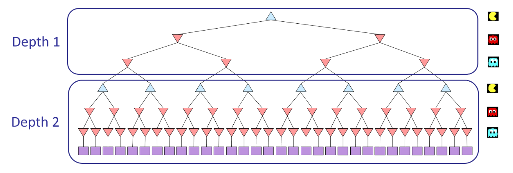
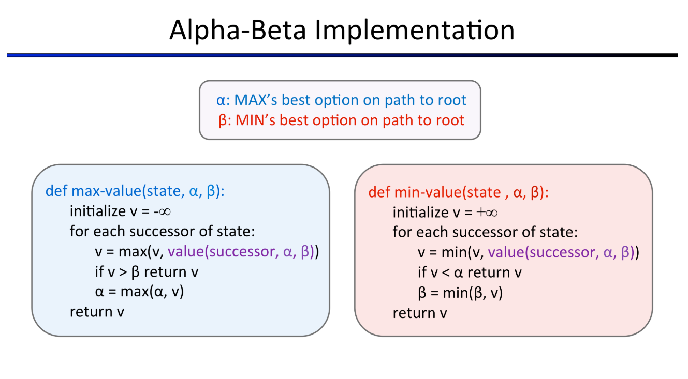

# Multi Agent Search
## Introduction
In this assignment, you will design agents for the classic version of Pacman, including ghosts. Along the way, you will implement both minimax and expectimax search and try your hand at evaluation function design.

The code base has not changed much from the previous assignment, but please start with a fresh installation, rather than intermingling files from assignment 1.

As in assignment 1, this assignment includes an autograder for you to grade your answers on your machine. This can be run on all questions with the command:
```
python autograder.py
```

It can be run for one particular question, such as q2, by:
```
python autograder.py -q q1
```
It can be run for one particular test by commands of the form:
```
python autograder.py -t test_cases/q2/0-small-tree
```

By default, the autograder displays graphics with the -t option, but doesn’t with the -q option. You can force graphics by using the --graphics flag, or force no graphics by using the --no-graphics flag.

See the autograder tutorial in assignment 0 for more information about using the autograder.

The code for this assignment contains the following files: Files you'll edit:

multiAgents.py	Where all of your multi-agent search agents will reside.
Files you might want to look at:

```
pacman.py	The main file that runs Pacman games. This file also describes a Pacman GameState type, which you will use extensively in this assignment.

game.py	The logic behind how the Pacman world works. This file describes several supporting types like AgentState, Agent, Direction, and Grid.

util.py	Useful data structures for implementing search algorithms. You don't need to use these for this assignment, but may find other functions defined here to be useful.
````

Supporting files you can ignore:
```
graphicsDisplay.py	Graphics for Pacman

graphicsUtils.py	Support for Pacman graphics

textDisplay.py	ASCII graphics for Pacman

ghostAgents.py	Agents to control ghosts

keyboardAgents.py	Keyboard interfaces to control Pacman

layout.py	Code for reading layout files and storing their contents

autograder.py	assignment autograder

testParser.py	Parses autograder test and solution files

testClasses.py	General autograding test classes

test_cases/	Directory containing the test cases for each question

multiagentTestClasses.py	assignment 2 specific autograding test classes
```

## Welcome to Multi-Agent Pacman
First, play a game of classic Pacman by running the following command:
```
python pacman.py
```
and using the arrow keys to move.

### Q1 (5 pts): Minimax
Now you will write an adversarial search agent in the provided MinimaxAgent class stub in multiAgents.py. Your minimax agent should work with any number of ghosts, so you’ll have to write an algorithm that is slightly more general than what you’ve previously seen in lecture. In particular, your minimax tree will have multiple min layers (one for each ghost) for every max layer.

Your code should also expand the game tree to an arbitrary depth. Score the leaves of your minimax tree with the supplied self.evaluationFunction, which defaults to scoreEvaluationFunction. MinimaxAgent extends MultiAgentSearchAgent, which gives access to self.depth and self.evaluationFunction. Make sure your minimax code makes reference to these two variables where appropriate as these variables are populated in response to command line options.

Important: A single search ply is considered to be one Pacman move and all the ghosts’ responses, so depth 2 search will involve Pacman and each ghost moving two times (see diagram below).



Grading: I will be checking your code to determine whether it explores the correct number of game states. This is the only reliable way to detect some very subtle bugs in implementations of minimax. As a result, the autograder will be very picky about how many times you call GameState.generateSuccessor. If you call it any more or less than necessary, the autograder will complain. To test and debug your code, run

```
python autograder.py -q q1
```

This will show what your algorithm does on a number of small trees, as well as a pacman game. To run it without graphics, use:

```
python autograder.py -q q1 --no-graphics
```
#### Hints and Observations
- Implement the algorithm recursively using helper function(s).

- The correct implementation of minimax will lead to Pacman losing the game in some tests. This is not a problem: as it is correct behaviour, it will pass the tests.

- The evaluation function for the Pacman test in this part is already written (self.evaluationFunction). You shouldn’t change this function, but recognize that now we’re evaluating states rather than actions, as we were for the reflex agent. Look-ahead agents evaluate future states whereas reflex agents evaluate actions from the current state.

- The minimax values of the initial state in the minimaxClassic layout are 9, 8, 7, -492 for depths 1, 2, 3 and 4 respectively. Note that your minimax agent will often win (665/1000 games for us) despite the dire prediction of depth 4 minimax.
```
 python pacman.py -p MinimaxAgent -l minimaxClassic -a depth=4
```

- Pacman is always agent 0, and the agents move in order of increasing agent index.

- All states in minimax should be GameStates, either passed in to getAction or generated via GameState.generateSuccessor. In this assignment, you will not be abstracting to simplified states.

- On larger boards such as openClassic and mediumClassic (the default), you’ll find Pacman to be good at not dying, but quite bad at winning. He’ll often thrash around without making progress. He might even thrash around right next to a dot without eating it because he doesn’t know where he’d go after eating that dot. Don’t worry if you see this behavior, question 5 will clean up all of these issues.

- When Pacman believes that his death is unavoidable, he will try to end the game as soon as possible because of the constant penalty for living. Sometimes, this is the wrong thing to do with random ghosts, but minimax agents always assume the worst:
```
  python pacman.py -p MinimaxAgent -l trappedClassic -a depth=3
```

Make sure you understand why Pacman rushes the closest ghost in this case.

### Q2 (5 pts): Alpha-Beta Pruning
Make a new agent that uses alpha-beta pruning to more efficiently explore the minimax tree, in AlphaBetaAgent. Again, your algorithm will be slightly more general than the pseudocode from lecture, so part of the challenge is to extend the alpha-beta pruning logic appropriately to multiple minimizer agents.

You should see a speed-up (perhaps depth 3 alpha-beta will run as fast as depth 2 minimax). Ideally, depth 3 on smallClassic should run in just a few seconds per move or faster.
```
python pacman.py -p AlphaBetaAgent -a depth=3 -l smallClassic
```

The AlphaBetaAgent minimax values should be identical to the MinimaxAgent minimax values, although the actions it selects can vary because of different tie-breaking behavior. Again, the minimax values of the initial state in the minimaxClassic layout are 9, 8, 7 and -492 for depths 1, 2, 3 and 4 respectively.

Grading: Because we check your code to determine whether it explores the correct number of states, it is important that you perform alpha-beta pruning without reordering children. In other words, successor states should always be processed in the order returned by GameState.getLegalActions. Again, do not call GameState.generateSuccessor more than necessary.

You must not prune on equality in order to match the set of states explored by our autograder. (Indeed, alternatively, but incompatible with our autograder, would be to also allow for pruning on equality and invoke alpha-beta once on each child of the root node, but this will not match the autograder.)

The pseudo-code below represents the algorithm you should implement for this question. 


To test and debug your code, run
```
python autograder.py -q q2
```

This will show what your algorithm does on a number of small trees, as well as a pacman game. To run it without graphics, use:
```
python autograder.py -q q2 --no-graphics
```

The correct implementation of alpha-beta pruning will lead to Pacman losing some of the tests. This is not a problem: as it is correct behaviour, it will pass the tests.